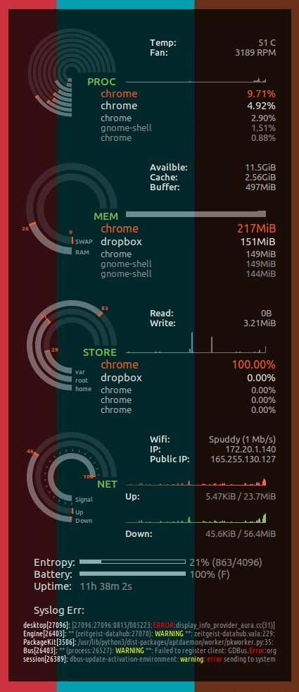

Conky Seamod theme
====================

Seamod theme was built by SeaJey. Maxiwell modified the original theme for conky 1.10 configuration. I tweaked it further with some major changes.

# Screenshot



# New Features

## by Maxiwell

* Disk Read/Write
* Lan/Ext IP's

## by JPvRiel

Fixes
* `border_outer_margin` can be used without breaking the alignment of rings
*  now runs on Ubuntu 16.04 LTS with Gnome 3.18  

Changes/enhancements
* `own_window_argb_value` conifg option if background and semi-transparency settings are desired
* 'Free' text info move to bottom so changes avoid interfering with alignment of rings
* Tweaked info per section, e.g. CPU temp, fan RPM, memory caches
* Added IO top info for disk / storage (to matches top process list for memory and processor)
* Entropy pool bar for crypto nerds (most users won't care and can remove/uncomment)
* Added example script to feed last 5 warning or error messages from syslog
* Wireless is shown if a wireless IP is present, else wired is shown (less hard-coded).

# Install and run

Install (should work in Gnome 3 at least)
```bash
mkdir -p ~/.conky/seamod
git clone --depth=1 https://github.com/JPvRiel/conky-seamod ~/.conky/seamod
cp ~/.conky/seamod/conky.desktop ~/.config/autostart/
```
Start (ad-hoc)
```
conky -d -c /home/a211278l/.conky/seamod/conkyrc.lua
```
Stop
```
killall conky
```

Hints
* Install location assumes `~/.conky/seamod`. If not, correct script references in `conkyrc.lua`.
* For auto-start, `conky.desktop` may need other tweaks for auto-start with other desktop environments.

## Modifying

Sadly the rings alignment with text is painfully brittle. Herewith, the most likely changes that are typically needed.

Modify rings needed in `seamod_rings.lua`
* typically changing the number of items that affects the rings implies needing to fiddle with `graph_radius` and `graph_thickness`
* change 'cpu' item list to match number of cores/threads returned by `nproc` command. (currently 8)
* change 'fs_used_perc' to suite systems partitioning scheme. E.g. I had 'root', 'home' and 'var' separate.

Modify network to monitor
* simply find and replace `eth0` (typical for wired) with the interface of interest, e.g. `wlan0` (typical for wireless) if your own device names differ.
* Needs to be done in both `seamod_rings.lua` and `conkyrc.lua`
E.g.
```
sed -i -e 's/eth0/eth1/g' ~/.conky/seamod/conkyrc.lua  ~/.conky/seamod/seamod_rings.lua
```

## Bugs / TODO

Conky should switch network info displayed when interfaces change. Some odd lag was noticed when switching
* `${if_match "${addr wlan0}" == "No Address"}` done in `conkyrc.lua`'s text section seems to change info quickly.
* `conky_parse('${if_match "${addr wlan0}" == "No Address"}no_wifi${endif}')` used in `seamod_rings.lua` works when loaded, but doesn't seem to update when interfaces change.

A work around is to kill and restart conky with `ifup` and `ifdown` scripts.


# Related Work

Click [here](http://www.deviantart.com/art/Conky-Seamod-v0-1-283461046) to see the original theme and screenshots.
Click [here](https://github.com/maxiwell/conky-seamod) for repo with previous version
